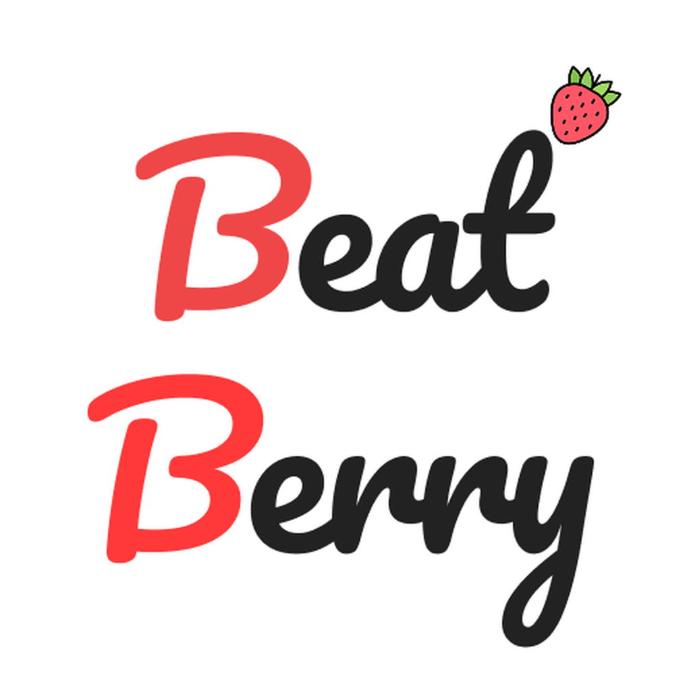
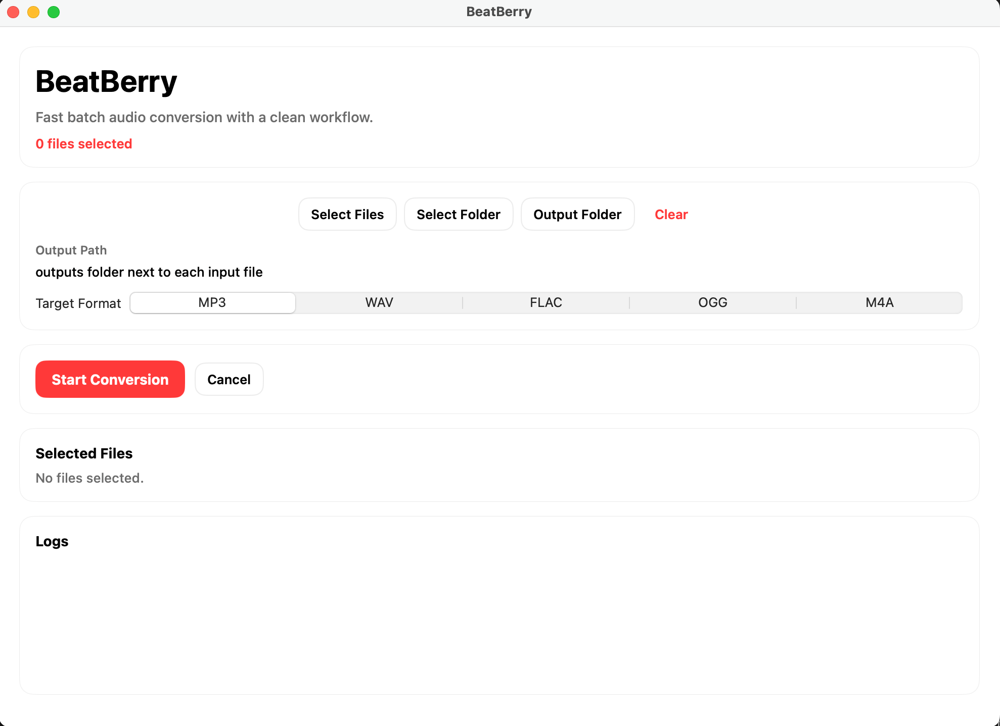

# 🍓 BeatBerry
<div align="center">
  
</div>

**BeatBerry** is an audio format conversion app for macOS.  
It uses a SwiftUI-based UI and a bundled FFmpeg engine, so users can convert audio files without installing Conda or Python.

## ✨ Key Features
<div align="center">
  
</div>
- Intuitive GUI: batch conversion via file/folder selection
- Supported formats: `mp3`, `wav`, `flac`, `ogg`, `m4a`
- Batch processing: progress, logs, and success/failure summary
- Default output rule: automatically creates an `outputs/` folder next to input files
- Single-app distribution: run immediately after installing `beatberry.dmg`

## 📦 Requirements
- macOS 13 or later
- End users: no additional installation required (FFmpeg is bundled in the app)
- Development/build environment: Xcode Command Line Tools, Swift 6

## 🚀 Quick Start (Developers)
```bash
git clone https://github.com/yourusername/beatberry.git
cd beatberry/BeatBerryMacOS
swift build
swift run
```

## 🛠️ Tests
```bash
cd BeatBerryMacOS
swift test
```

## 📀 DMG Packaging
Use `BeatBerryMacOS/scripts/package_dmg.sh`.

```bash
cd BeatBerryMacOS
BEATBERRY_FFMPEG_SOURCE=/opt/homebrew/bin/ffmpeg ./scripts/package_dmg.sh
```

Outputs:
- `BeatBerryMacOS/dist/BeatBerry.app`
- `BeatBerryMacOS/dist/beatberry.dmg`

Options:
- Code signing: set `BEATBERRY_CODESIGN_IDENTITY="Developer ID Application: ..."`
- Notarization: set `BEATBERRY_NOTARY_PROFILE="<keychain-profile-name>"`

Example (signed + notarized release):
```bash
cd BeatBerryMacOS
BEATBERRY_FFMPEG_SOURCE=/opt/homebrew/bin/ffmpeg \
BEATBERRY_CODESIGN_IDENTITY="Developer ID Application: YOUR NAME (TEAMID)" \
BEATBERRY_NOTARY_PROFILE="beatberry-notary" \
./scripts/package_dmg.sh
```

## 🧭 Project Structure
```text
BeatBerryMacOS/
  Sources/
    App/                 # Composition root (DI wiring)
    Domain/              # Entities / value objects / ports
      Models/
      Ports/
    Application/         # Use cases
      UseCases/
    Infrastructure/      # External system implementations
      Services/
      FileSystem/
    Presentation/        # SwiftUI views + view models
      Views/
      ViewModels/
  Tests/
    BeatBerryMacOSTests/
  scripts/package_dmg.sh
  packaging/Info.plist
```

## 📄 License
This project is licensed under the GNU General Public License v3.0 (GPL-3.0). For more details, please refer to the [LICENSE](LICENSE) file.

## 📚 Third-Party Licenses
This project bundles FFmpeg in distributed app binaries.

- Third-party notices: [THIRD_PARTY_NOTICES.md](THIRD_PARTY_NOTICES.md)
- FFmpeg legal information: https://ffmpeg.org/legal.html

## 📝 Questions or Support
If you have any questions or need support, feel free to open an issue on GitHub or reach out via the following contact methods:

 - Email: logicallawbio@gmail.com
 - GitHub: logicallaw
